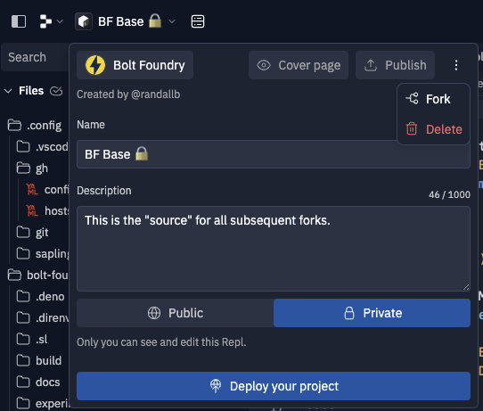

# Welcome to the Bolt Foundry development experience

We're trying to make this so anyone can drop in, make some changes, ship some
love, without knowing very much about how to do things.

## The flow

### Fork the base

Go to [BF-base](https://replit.com/t/bolt-foundry/xjbbzx/repls/BF-Base), click
the name in the upper left corner, then hit the three dots menu, and select
"Fork".



Now, give it a name related to your project, ideally prefixed with your name,
and enter a description to help others know what your fork is intended to do.


At this point, Replit will automatically redirect you to your repl. You should
be seeing this document as a result of that. Look in the upper left corner to
ensure you've moved on from the base.

### Edit your files

This is the simple part, you'll probably find files using `cmd + p` to use the
quick open dialog.

### Preview changes

To preview changes, all you need to do is hit the giant `▶ Run` button at the
top of replit. Initially this will open the console, and then when the app is
ready, it'll open a webview.

To refresh after making a change, hit `cmd + enter` and it'll reload the server.

### Commit changes

Open the shell by using either the command pallate (cmd + k) and typing "shell",
or ctrl + tilde (~) or as a tab in the UI. Within the shell, run the command:

```sh
bff commit 
```

This will automatically log you into github, and open VS Code.

!!!!!!!!!!!!!!!!!!!!!!!!!!!!!!!!!!!!!!!!!!!!!!!!!!!!!!!!!!!!!!!!!!!!!!!!!!!!!!!!

**DO NOT EDIT FILES USING VSCODE. VS CODE IS ONLY FOR USING SAPLING.**

!!!!!!!!!!!!!!!!!!!!!!!!!!!!!!!!!!!!!!!!!!!!!!!!!!!!!!!!!!!!!!!!!!!!!!!!!!!!!!!!

All of our tooling is built for Replit, except one: Sapling. For now, that
dependency still relies on us using VSCode. We anticipate that going away with
the next release of sapling.

#### Individual commits are "whole changes" bundled into one

Your goal should be to commit individual units of changes one commit at a time.
[Sapling's smartlog overview](https://sapling-scm.com/docs/overview/smartlog)
explains the nitty gritty of smartlog better than I could.

#### Submitting commits will automatically create pull requests

Since Sapling doesn't use branches, commits will automatically be turned into
pull requests and branches, etc., without you needing to do anything.

### Code Review

Code review mostly happens synchronously via pair coding, but if you're working
async, ping
[#code-corner on Discord](https://discord.com/channels/1128726973770903703/1128760802636218568)
with a link to the commit you'd like to review, and ping the `@Code Reviewers`
role.

### Landing

Code reviewers will go back and forth, and eventually you'll get your commit
approved. Then, merge it using GitHub.

### Deploying

Warning: This sucks super badly right now, but will get better soon hopefully.

Go to the
[boltfoundry.com repl](https://replit.com/t/bolt-foundry/xjbbzx/repls/boltfoundrycom).
Run:

```sh
bff update
```

then hit the big "redeploy" button in the upper right corner.

**IMPORTANT**: You'll have to repeat this process for the worker, but that
doesn't exist yet.
