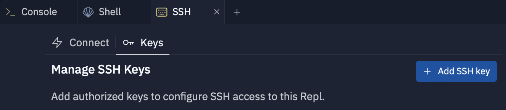
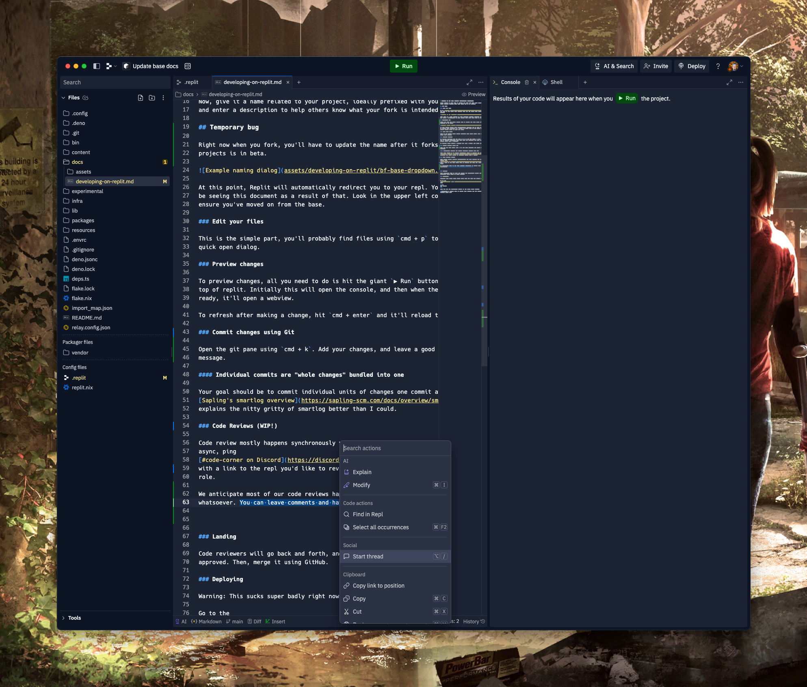
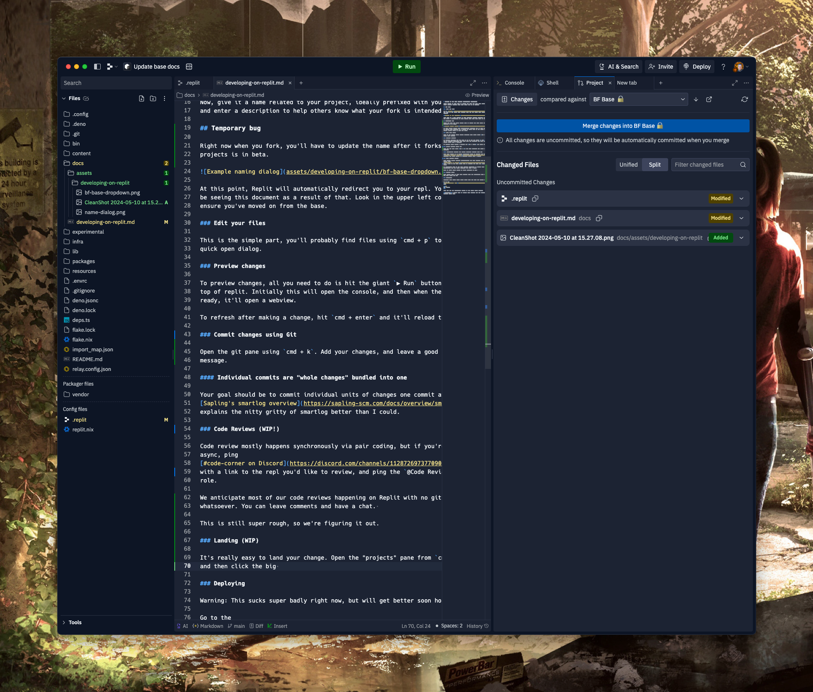

# Welcome to the Bolt Foundry development experience

We're trying to make this so anyone can drop in, make some changes, ship some
love, without knowing very much about how to do things.

## The flow

### Fork the base

Go to
[BF-base Project Page](https://replit.com/t/bolt-foundry/xjbbzx/projects/j24RGL9x),
select "Fork".

Now, give it a name related to your project, ideally prefixed with your name,
and enter a description to help others know what your fork is intended to do.

## Temporary bug

Right now when you fork, you'll have to update the name after it forks because
projects is in beta.

At this point, Replit will automatically redirect you to your repl. You should
be seeing this document as a result of that. Look in the upper left corner to
ensure you've moved on from the base.

### Setup SSH Key

Generate an SSH key with 1password or `ssh-keygen`, copy it, add it to your fork
under the SSH tab.

### Add your Bolt Foundry email to your Github

Click your profile icon in the top right, select `Settings`. In Settings, go to
`Emails`, and add your Bolt Foundry email and verify.

### Edit your files

This is the simple part, you'll probably find files using `cmd + p` to use the
quick open dialog.

### Preview changes

To preview changes, all you need to do is hit the giant `▶ Run` button at the
top of replit. Initially this will open the console, and then when the app is
ready, it'll open a webview.

To refresh after making a change, hit `cmd + enter` and it'll reload the server.

### Commit changes using Sapling

Open VSCode by typing `bff commit` in your shell in replit. Allow any popups. You should see your changes reflected in the Interactive Smartlog.

Select changes you want to commit, give the commit a name and short description, and hit `Commit and Submit`.

#### Individual commits are "whole changes" bundled into one

Your goal should be to commit individual units of changes one commit at a time.

### Code Reviews (WIP!)

Create a changelog entry in the proper year / month combo. This should include a
comprehensive overview of the changes, and a test plan.

Code review mostly happens synchronously via pair coding, but if you're working
async, ping
[#code-corner on Discord](https://discord.com/channels/1128726973770903703/1128760802636218568)
with a link to the repl you'd like to review, and ping the `@Code Reviewers`
role.

We anticipate most of our code reviews happening on Replit with no github
whatsoever. You can leave comments and have a chat.

This is still super rough, so we're figuring it out.

### Landing (WIP)

It's really easy to land your change. Open the "projects" pane from `cmd+k` and
then click the big merge changes into bf base button.

### Deploying (WIP)

rb will make a script. For now ask him how to deploy for real.
